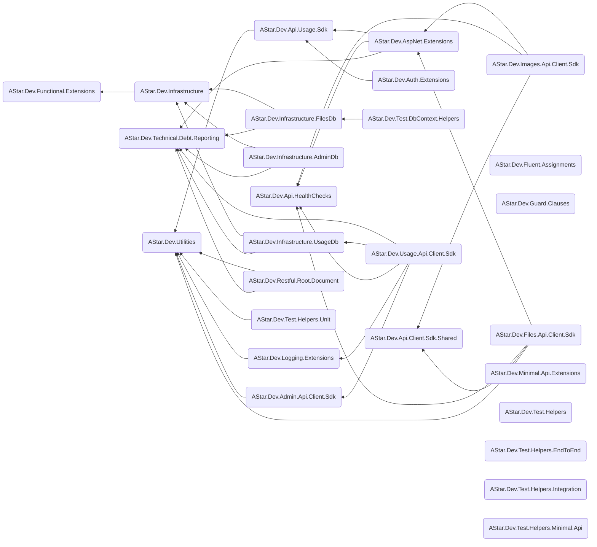

# NuGet Package Details and inter-package Usage

## Package list

In the list below, the bracketed letters are used to help me track whilst I rebuild the mermaid diagram. They can be ignored and will ultimately be removed.

1. (A) [AStar.Dev.Technical.Debt.Reporting](https://github.com/astar-development/astar-dev-technical-debt-reporting) - NO Dependencies on other AStar Dev packages is allowed
1. (B) [AStar.Dev.Utilities](https://github.com/astar-development/astar-dev-utilities)
1. (C) [AStar.Dev.Admin.Api.Client.Sdk](https://github.com/astar-development/astar-dev-admin-api-client-sdk)
1. (D) [AStar.Dev.Api.Client.Sdk.Shared](https://github.com/astar-development/astar-dev-api-client-sdk-shared)
1. (E) [AStar.Dev.Api.HealthChecks](https://github.com/astar-development/astar-dev-api-health-checks)
1. (F) [AStar.Dev.Api.Usage.Sdk](https://github.com/astar-development/astar-dev-api-usage-sdk)
1. (G) [AStar.Dev.AspNet.Extensions](https://github.com/astar-development/astar-dev-aspnet-extensions)
1. (H) [AStar.Dev.Auth.Extensions](https://github.com/astar-development/astar-dev-auth-extensions)
1. (I) [AStar.Dev.Files.Api.Client.Sdk](https://github.com/astar-development/astar-dev-files-api-client-sdk)
1. (J) [AStar.Dev.Fluent.Assignments](https://github.com/astar-development/astar-dev-fluent-assignments)
1. (K) [AStar.Dev.Functional.Extensions](https://github.com/astar-development/astar-dev-functional-extensions)
1. (L) [AStar.Dev.Guard.Clauses](https://github.com/astar-development/astar-dev-guard-clauses)
1. (M) [AStar.Dev.Images.Api.Client.Sdk]()https://github.com/astar-development/astar-dev-images-api-client-sdk
1. (N) [AStar.Dev.Infrastructure](https://github.com/astar-development/astar-dev-infrastructure)
1. (O) [AStar.Dev.Infrastructure.AdminDb](https://github.com/astar-development/astar-dev-infrastructure-admindb)
1. (P) [AStar.Dev.Infrastructure.FilesDb](https://github.com/astar-development/astar-dev-infrastructure-filesdb)
1. (Q) [AStar.Dev.Infrastructure.UsageDb](https://github.com/astar-development/astar-dev-infrastructure-usagedb)
1. (R) [AStar.Dev.Logging.Extensions](https://github.com/astar-development/astar-dev-logging-extensions)
1. (S) [AStar.Dev.Minimal.Api.Extensions](https://github.com/astar-development/astar-dev-minimal-api-extensions)
1. (T) [AStar.Dev.Restful.Root.Document](https://github.com/astar-development/astar-dev-restful-root-document)
1. (U) [AStar.Dev.Test.DbContext.Helpers](https://github.com/astar-development/astar-dev-test-dbcontext-helpers)
1. (V) [AStar.Dev.Test.Helpers](https://github.com/astar-development/astar-dev-test-helpers)
1. (W) [AStar.Dev.Test.Helpers.EndToEnd](https://github.com/astar-development/astar-dev-test-helpers-endtoend)
1. (X) [AStar.Dev.Test.Helpers.Integration](https://github.com/astar-development/astar-dev-test-helpers-integration)
1. (Y) [AStar.Dev.Test.Helpers.Minimal.Api](https://github.com/astar-development/astar-dev-test-helpers-minimal-api)
1. (Z) [AStar.Dev.Test.Helpers.Unit](https://github.com/astar-development/astar-dev-test-helpers-unit)
1. (ZA) [AStar.Dev.Usage.Api.Client.Sdk](https://github.com/astar-development/astar-dev-usage-api-client-sdk)

